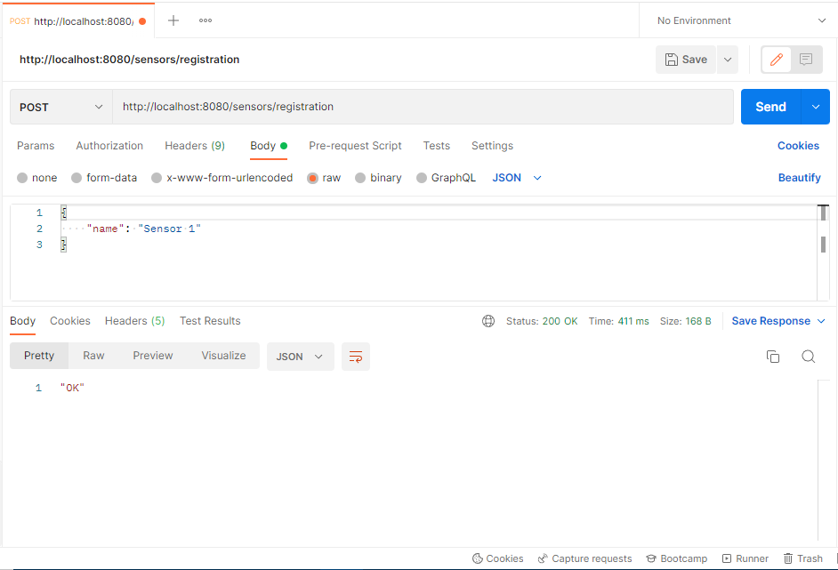
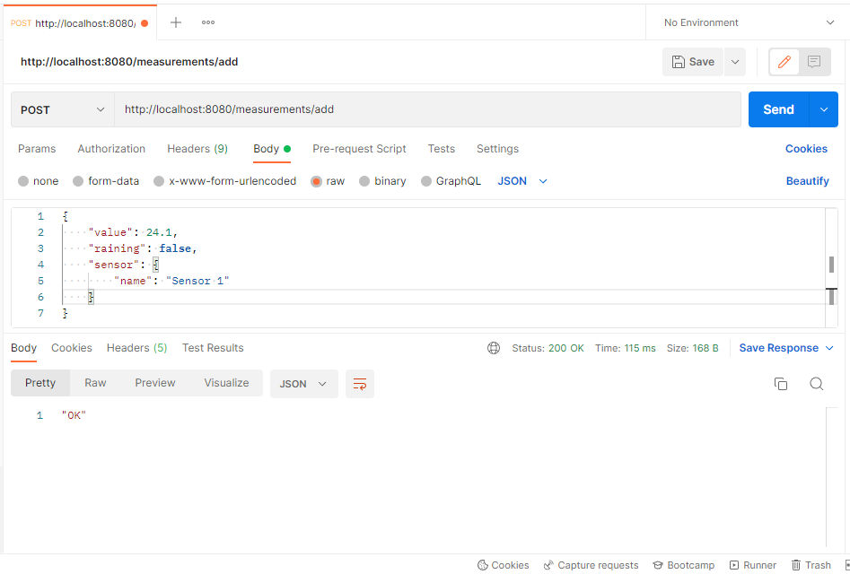
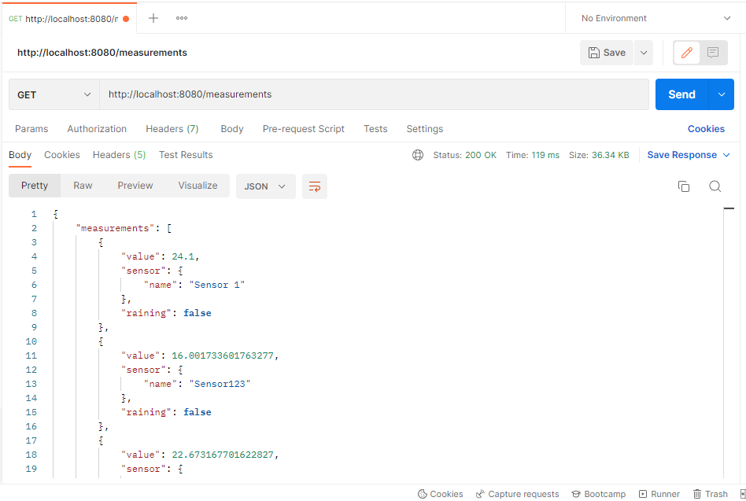
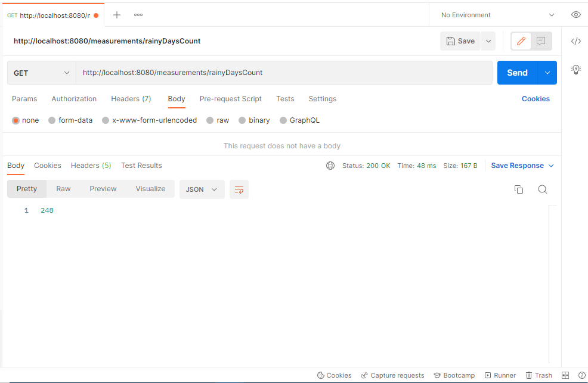
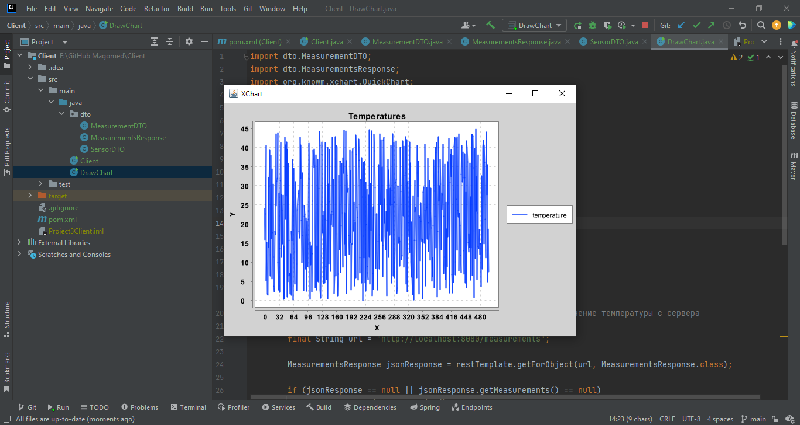

# Meteorological sensor

## Описание:
REST API приложение для получения данных о температуре окружающего воздуха и информации идет дождь или нет.
Эти данные будут сохранены в БД для дальнейшего анализа.

Для того чтобы отправлять запросы к REST API приложению, я создал другое приложение 
с использованием RestTemplate. RestTemplate позволяет слать запросы к
сторонним REST API сервисам. 
Ссылка на приложение ```https://github.com/M-Magomedov/Meteorological-sensor-client.git```

---
## Технологии:
Java 8, Spring Boot, Spring WEB, Spring Data JPA, MySQL, Validation, Hibernate

---

## Возможности и опции:
1) Добавление нового датчика в БД.
2) Добавление новых данных состояния окружающей среды в БД.
3) Получение всех измерений.
4) Получение количества дождливых дней.
5) Валидация данных

---

## Дополнительная информация:
Благодаря другому приложения, который использует RestTemplate, будут выполнены следующие задачи:
1) Регистрация нового датчика
2) Отправка 500 запросов со случайными температурами и "дождями" на адрес: ```POST/measurements/add```
3) Получение этих 500 запросов на адрес: ```/measurements``` отправив GET запрос.
4) Построение графика температур, получив 500 температур с сервера. 

---

## Запуск:

1. Клонировать репозитории:

   ```git 
   https://github.com/M-Magomedov/Meteorological-sensor.git
   https://github.com/M-Magomedov/Meteorological-sensor-client.git
   ```

2. Собрать оба проекта с помощью Maven
   ```
   mvn clean install
   ```
   
3. Запустить оба приложения

4. Открыть Postman

## Добавление датчика без дополнительного приложения


## Добавление измерения данных окружающей среды без дополнительного приложения


## Получение всех измерений после использования дополнительного приложения


## Получение количества дождливых дней после использования дополнительного приложения


## Построение графика температур



